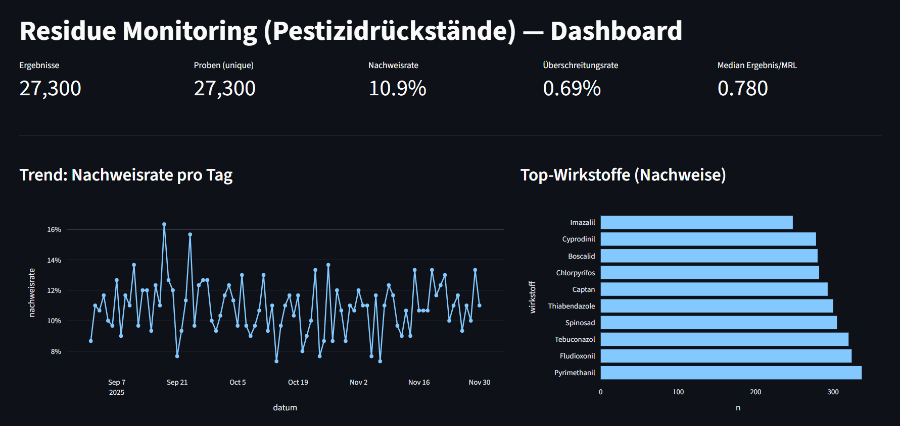

# Fruitmonitoring – Datenanalyse im Bereich Lebensmittelsicherheit
### Überblick

Dieses Projekt zeigt, wie Rückstandsmonitoring-Daten von Obst und Gemüse mithilfe von Python-basierter Datenanalyse ausgewertet werden können, um Lebensmittelsicherheit, Qualitätssicherung und regulatorische Bewertung zu unterstützen.

Der Fokus liegt darauf, analytische Labordaten strukturiert aufzubereiten und in aussagekräftige Erkenntnisse zu überführen, die Transparenz schaffen und fundierte Entscheidungen entlang der Lebensmittelkette ermöglichen.

## Projektbeschreibung

Dieses Projekt zeigt, wie Daten aus einem Rückstandsmonitoring von Obst und Gemüse mithilfe von Python analysiert werden können.

Der Fokus liegt auf der explorativen Datenanalyse (EDA) von:

- Produkten

- Produktgruppen

- Herkunft

- Wirkstoffen (Pestiziden)

#### Ziel ist es, Muster, Trends und Auffälligkeiten in Rückstandsdaten transparent und reproduzierbar auszuwerten und damit die fachliche Bewertung im Lebensmittel- und Qualitätsmonitoring zu unterstützen.
-----------------------------------------------------------------------------------

Figure 1. Dashboard

### Zielsetzung

- Strukturierte Auswertung von Monitoring-Daten

- Sicherstellung der Datenqualität (QC-Checks)

- Analyse von Wirkstoff- und Herkunftsmustern

- Unterstützung der fachlichen Interpretation von Rückstandsprofilen

- Grundlage für Berichte und Entscheidungsfindung im Handel

### Was dieses Projekt zeigt

Dieses Projekt demonstriert meine Fähigkeit:

- analytische Labor- und Monitoringdaten zu interpretieren

- mit Datenbank-Exporten (CSV/Excel) zu arbeiten

- Datenqualität und Plausibilität sicherzustellen

- Muster, Trends und Auffälligkeiten zu erkennen

- Ergebnisse klar und entscheidungsrelevant zu kommunizieren

Es spiegelt typische Aufgaben im Bereich Rückstandsmonitoring, Lebensmittelsicherheit und Qualitätsmanagement wider.

## Datengrundlage

Die Analyse basiert auf Monitoringdaten, wie sie in Rückstandsüberwachungssystemen verwendet werden. Die Daten sind simuliert.

#### Zentrale Analyseebenen:

- Produkt

- Produktgruppe

- Herkunft

- Wirkstoffe (Pestizide)

#### Zusätzliche Informationen:

- Analytischer Messwert & LOQ

- Proben- oder Analysedatum

- Labor / Methode

- MRL-Referenzen gemäß VO (EG) Nr. 396/2005

## Methodik
#### 1️. Datenimport & Bereinigung

- Einlesen von CSV/Excel mit pandas

- Harmonisierung von Produkt-, Herkunfts- und Wirkstoffnamen

- Umwandlung numerischer Werte (Messwert, LOQ)

- Datumshandling für Trendanalysen

#### 2️. Datenqualitäts-Checks

- Fehlende Werte (Messwert, LOQ)

- Negative oder unplausible Ergebnisse

- Konsistenz von Einheiten

- Dokumentation der QC-Kennzahlen

Audit- und ISO-17025-konform gedacht

#### 3️. Ableitungen & Kennzahlen

- Nachweis: Messwert ≥ LOQ

- MRL-Überschreitung: Messwert > MRL

- Anzahl Wirkstoffe pro Probe (Mehrfachrückstände)

- Häufigkeiten nach Produktgruppe, Herkunft und Wirkstoff

#### 4️. Analysen

- Verteilung von Produktgruppen

- Herkunftsabhängige Muster

- Häufigkeit einzelner Wirkstoffe

- Kreuztabellen (z. B. Produktgruppe × Herkunft)

- Zeitliche Trends (monatlich / saisonal)

#### 5️. Visualisierung

- Diagramme (Top-Produktgruppen, Wirkstoffe)

- Zeitreihen für Trendanalysen

- Übersichtstabellen für Berichte

## Beispielhafte Fragestellungen

- Welche Produktgruppen werden am häufigsten untersucht?

- Gibt es herkunftsspezifische Rückstandsmuster?

- Welche Wirkstoffe treten besonders häufig auf?

- Lassen sich zeitliche Trends erkennen?

- Wo treten Mehrfachrückstände auf?

## Analytischer Ansatz
#### 1. Datenaufbereitung & Qualitätsprüfung

- Konsistenz- und Plausibilitätsprüfungen

- Harmonisierung von Produkt-, Herkunfts- und Wirkstoffnamen

- Umgang mit <LOQ-Werten und fehlenden Daten

#### 2. Zentrale Kennzahlen

- Nachweisraten

- Mehrfachrückstandsprofile

- Verteilungen nach Produktgruppe und Herkunft

- Zeitliche Trends

#### 3. Fachliche Einordnung

- Fokus auf Muster und Entwicklungen, nicht auf Einzelwerte

- Berücksichtigung des regulatorischen Kontexts
(MRL = rechtlicher Grenzwert, kein toxikologischer Grenzwert)

- Reproduzierbare und transparente Ergebnisse

## Eingesetzte Werkzeuge & Kompetenzen

- Python (pandas, numpy, matplotlib)

- Explorative Datenanalyse (EDA)

- Datenqualitätsprüfung

- Monitoring- und Trendanalyse

- Regulatorisches Verständnis im Bereich Pestizidrückstände

- Strukturierte Dokumentation & Ergebnisaufbereitung

## Verwendete Technologien

- Python

- pandas

- numpy

- matplotlib

- Jupyter Notebook

## Warum dieses Projekt relevant ist

Wirksame Lebensmittelsicherheit endet nicht im Labor.
Entscheidend ist die korrekte Interpretation und Nutzung von Daten.

Dieses Projekt zeigt, wie sich analytische Expertise und Data Science verbinden lassen, um:

- Qualitätsentscheidungen zu unterstützen

- Trends frühzeitig zu erkennen

- Transparenz in Lieferketten zu verbessern

- Laborergebnisse in einen regulatorischen und fachlichen Kontext zu setzen

## Hinweis zur Interpretation

Die dargestellten Auswertungen dienen der fachlichen Einordnung und Trendanalyse.
Einzelne MRL-Überschreitungen stellen nicht automatisch ein gesundheitliches Risiko dar, da MRLs rechtliche und keine toxikologischen Grenzwerte sind.
Eine sachliche Interpretation im Kontext ist daher essenziell.

## Hintergrund

Dieses Projekt ist im Kontext von Lebensmittelsicherheit, Rückstandsmonitoring und Qualitätssicherung angesiedelt und richtet sich an Fachpersonen aus:

- Lebensmittelanalytik

- Qualitätsmanagement

- Handel & Lieferkette

- Regulierung & Monitoring

## Beruflicher Kontext

Dieses Projekt passt besonders zu Rollen wie:

- Wissenschaftliche/r Referent/in

- Food Safety Data Analyst/in

- Spezialist/in Rückstandsmonitoring

- Quality & Compliance Analyst/in (Lebensmittel)

## Über mich

Naturwissenschaftlicher Hintergrund mit Berufserfahrung in Pestizidanalytik und Datenbewertung.
Besonderes Interesse an datengetriebenen Ansätzen zur Verbesserung von Qualitätssystemen und Verbraucherschutz.

Hinweis:
Die verwendeten Daten sind anonymisiert, beispielhaft - bzw. simuliert.
Der Fokus liegt auf Methodik, Analyse und Interpretation, nicht auf einzelnen Unternehmen oder Produkten.

## Kontakt

Bei Fragen oder Interesse an Austausch zu Food Safety, Rückstandsanalytik oder Datenanalyse:

##### rina-ink | Marina Dominkovic

##### (Scientific Associate / Food Safety Background)