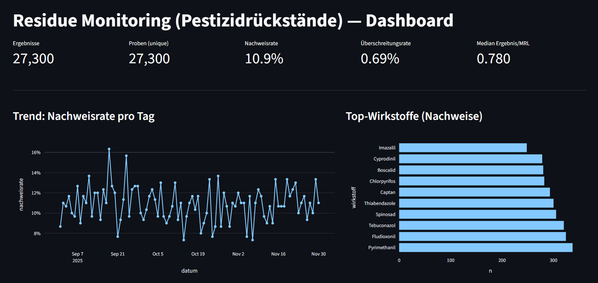
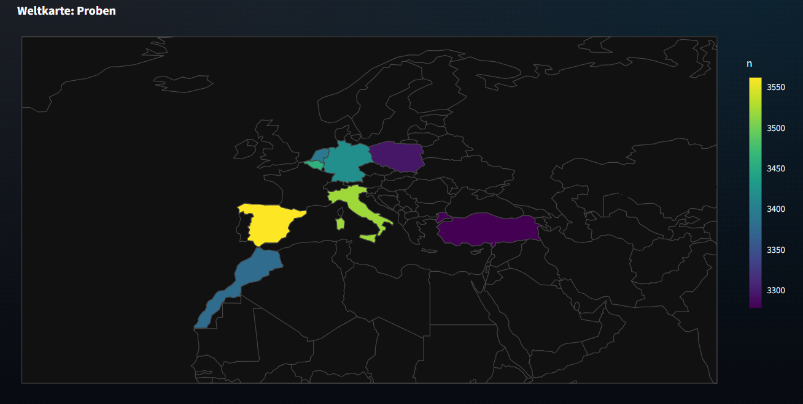
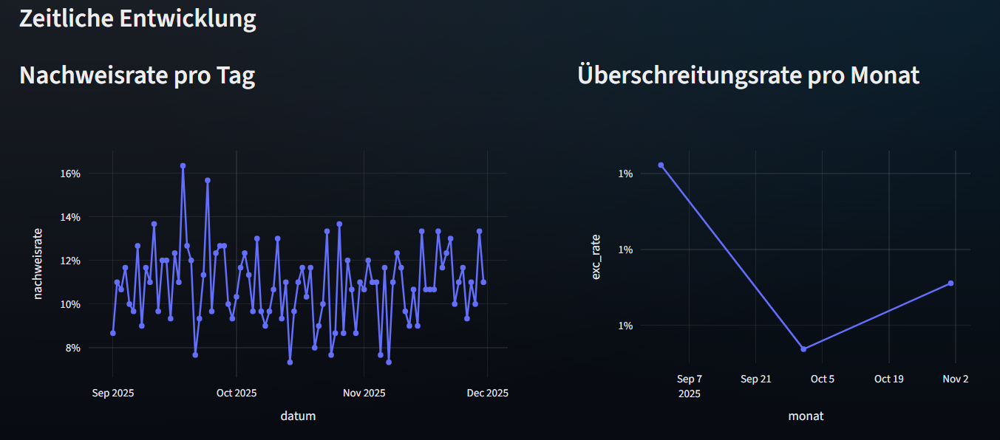
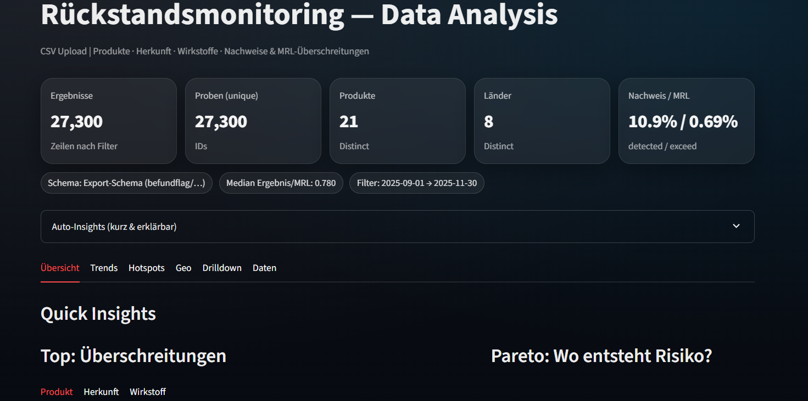

# Fruit monitoring – Data analysis in the field of food safety
### Overview
This project shows how residue monitoring data from fruit and vegetables can be evaluated using Python-based data analysis to support food safety, quality assurance, and regulatory assessment.

The focus is on preparing analytical laboratory data in a structured manner and converting it into meaningful insights that create transparency and enable informed decisions along the food chain.

## Project description
This project shows how data from residue monitoring of fruit and vegetables can be analyzed using Python.

The focus is on exploratory data analysis (EDA) of:

- Products

- Product group

- Origin

- Active substances (pesticides)

#### The aim is to evaluate patterns, trends, and anomalies in residue data in a transparent and reproducible manner, thereby supporting technical assessment in food and quality monitoring.

Figure 1. Dashboard

### Objectives
- Structured evaluation of monitoring data

- Ensuring data quality (QC checks)

- Analysis of active ingredient and origin patterns

- Support for the technical interpretation of residue profiles

- Basis for reports and decision-making in trade

### What this project shows
This project demonstrates my ability to:

- Interpret analytical laboratory and monitoring data

- Work with database exports (CSV/Excel)

- Ensuring data quality and plausibility

- Identifying patterns, trends, and anomalies

- Communicating results clearly and in a way that is relevant to decision-making

It reflects typical tasks in the areas of residue monitoring, food safety, and quality management.

## Dataset

The analysis is based on monitoring data as used in residue monitoring systems. The data is simulated.

#### Central analysis levels:

- Product

- Product group

- Origin

- Active substances (pesticides)

#### Additional information:

- Analytical measurement value & LOQ

- Sample or analysis date

- Laboratory / method

- MRL references in accordance with Regulation (EC) No. 396/2005

## Methodology
#### 1️. Data import & cleansing

- Importing CSV/Excel files with pandas

- Harmonization of product, origin, and active ingredient names

- Conversion of numerical values (measured value, LOQ)

- Date handling for trend analyses

#### 2️. Data quality checks

- Missing values (measured value, LOQ)

- Negative or implausible results

- Consistency of units

- Documentation of QC key figures

Audit and ISO 17025 compliant

#### 3️. Derivations & key figures

- Verification: Measured value ≥ LOQ

- MRL exceeded: Measured value > MRL

- Number of active substances per sample (multiple residues)

- Frequencies by product group, origin, and active substance

#### 4️. Analyses

- Distribution of product groups

- Origin-dependent patterns

- Frequency of individual active substances

- Cross tables (e.g., product group × origin)

- Temporal trends (monthly/seasonal)

#### 5️. Visualization
- Charts (top product groups, active ingredients)
- Time series for trend analyses
- Overview tables for reports

Figure 2. Geo view

## Sample questions
- Which product groups are most frequently tested?
- Are there any residue patterns specific to certain origins?
- Which active ingredients occur particularly frequently?
- Can any temporal trends be identified?
- Where do multiple residues occur?

## Analytical approach

#### 1. Data preparation & quality control
- Consistency and plausibility checks
- Harmonization of product, origin, and active ingredient names
- Handling of <LOQ values and missing data

#### 2. Key figures
- Detection rates
- Multiple residue profiles
- Distributions by product group and origin
- Temporal trends

#### 3. Technical classification
- Focus on patterns and developments, not on individual values
- Consideration of the regulatory context
(MRL = legal limit, not a toxicological limit)
- Reproducible and transparent results

Figure 3. Trends

## Tools & skills used
- Python (pandas, numpy, matplotlib)
- Exploratory data analysis (EDA)
- Data quality testing
- Monitoring and trend analysis
- Regulatory understanding in the field of pesticide residues
- Structured documentation & results preparation

## Technologies used
- Python
- pandas
- numpy
- matplotlib
- Jupyter Notebook

## Why this project is relevant
Effective food safety does not end in the laboratory.
The correct interpretation and use of data is crucial.

This project shows how analytical expertise and data science can be combined to:

- Support quality decisions

- Identify trends at an early stage

- Improve transparency in supply chains

- Place laboratory results in a regulatory and technical context

-----------------------------------------------------------------
-----------------------------------------------------------------
-----------------------------------------------------------------
-----------------------------------------------------------------
-----------------------------------------------------------------

Figure 4. Fruit scan

## Note on interpretation

The evaluations presented are for technical classification and trend analysis purposes.
Individual MRL exceedances do not automatically pose a health risk, as MRLs are legal limits and not toxicological limits.
An objective interpretation in context is therefore essential.

## Dataset

Note:
The data used is anonymized, exemplary, or simulated.
The focus is on methodology, analysis, and interpretation, not on individual companies or products.

## Background

This project is situated in the context of food safety, residue monitoring, and quality assurance and is aimed at professionals from the following fields:

- Food analysis

- Quality management

- Trade & supply chain

- Regulation & monitoring

## Professional context

This project is particularly suitable for roles such as:

- Scientific Advisor

- Food Safety Data Analyst

- Residue Monitoring Specialist

- Quality & Compliance Analyst (food)

## About me

Scientific background with professional experience in pesticide analysis and data evaluation.
Particular interest in data-driven approaches to improving quality systems and consumer protection.

## Contact

If you have any questions or are interested in discussing food safety, residue analysis, or data analysis:

##### rina-ink | Marina Dominkovic

##### (Scientific Associate / Food Safety Background)

